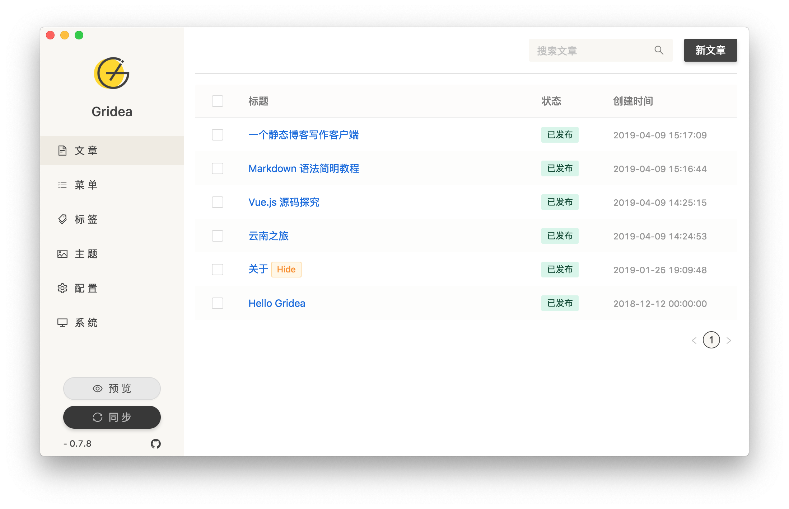

<div align="center">
  <a href="https://gridea.dev">
    
  </a>
  <h1 align="center">
    Gridea
  </h1>
  <h3 align="center">
    一个静态博客写作客户端
  </h3>

  [下 载](https://github.com/getgridea/gridea/releases) | [主 页](https://gridea.dev/)

  <a href="https://github.com/getgridea/gridea/releases/latest">
    
  </a>

  <a href="https://github.com/getgridea/gridea/blob/master/LICENSE">
    
  </a>

  <a href="https://github.com/getgridea/gridea/releases/latest">
    
  </a>

</div>

<div align="center">
  
</div>

[English](https://github.com/getgridea/gridea/blob/master/README.md) | 简体中文 | [繁體中文](https://github.com/getgridea/gridea/blob/master/README-zh_TW.md)

**[更新日志](https://github.com/getgridea/gridea/blob/master/CHANGELOG.md)**  

👏  欢迎使用 **Gridea** ！  

✍️  **Gridea** 一个静态博客写作客户端。你可以用它来记录你的生活、心情、知识、笔记、创意... ... 

## 特性👇
📝  你可以使用最酷的 **Markdown** 语法，进行快速创作  

🌉  你可以给文章配上精美的封面图和在文章任意位置插入图片  

🏷️  你可以对文章进行标签分组  

📋  你可以自定义菜单，甚至可以创建外部链接菜单  

💻  你可以在 **𝖶𝗂𝗇𝖽𝗈𝗐𝗌** 或 **𝖬𝖺𝖼𝖮𝖲** 或 **Linux** 设备上使用此客户端  

🌎  你可以使用 **𝖦𝗂𝗍𝗁𝗎𝖻 𝖯𝖺𝗀𝖾𝗌** 或 **Coding Pages** 向世界展示，未来将支持更多平台  

💬  你可以进行简单的配置，接入 [Gitalk](https://github.com/gitalk/gitalk) 或 [DisqusJS](https://github.com/SukkaW/DisqusJS) 评论系统  

🇬🇧  你可以使用**中文简体**、**中文繁体**、**英语**  

🌁  你可以任意使用应用内默认主题或任意第三方主题，强大的主题自定义能力  

🖥  你可以自定义源文件夹，利用 OneDrive、百度网盘、iCloud、Dropbox 等进行多设备同步  

🌱 当然 **Gridea** 还很年轻，有很多不足，但请相信，它会不停向前🏃

未来，它一定会成为你离不开的伙伴

尽情发挥你的才华吧！

😘 Enjoy~

## 开发
如果你想贡献代码，请提前参阅[贡献指南](https://github.com/getgridea/gridea/wiki/%E8%B4%A1%E7%8C%AE%E6%8C%87%E5%8D%97)
``` shell
$ # Node version > v10.0.0 is requied
$ git clone https://github.com/getgridea/gridea.git
$ cd gridea
$ yarn
$ yarn electron:serve
$ yarn electron:build
```

## 联系
[Telegram 频道](https://t.me/joinchat/AAAAAEj82_lma0Y1wmyqUQ) | [Telegram 群组](https://t.me/joinchat/IDY0ahRqb8NPodv95BNpBg)  | QQ 1 群: 970332209（已满）| QQ 2 群: 923131213 | 作者推特: @EryouHao

## 示例截图
<div align="center">
  
</div>

## 贡献
我们欢迎任何形式的贡献。你可以用 [pull requests](https://github.com/getgridea/gridea/pulls) 或 [issues](https://github.com/getgridea/gridea/issues) 的方式提交任何想法。  

## 支持
<div>
  
</div>

## License
[MIT](https://github.com/getgridea/gridea/blob/master/LICENSE). Copyright (c) 2020 EryouHao
