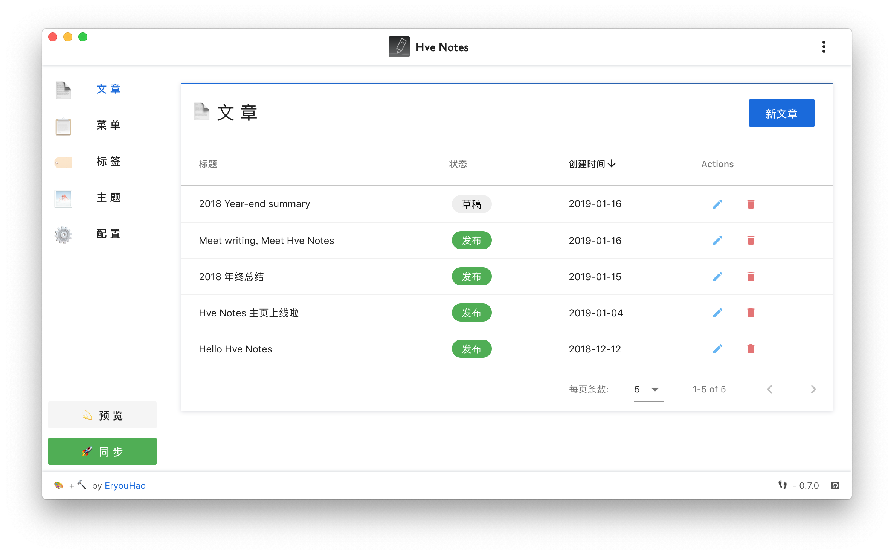
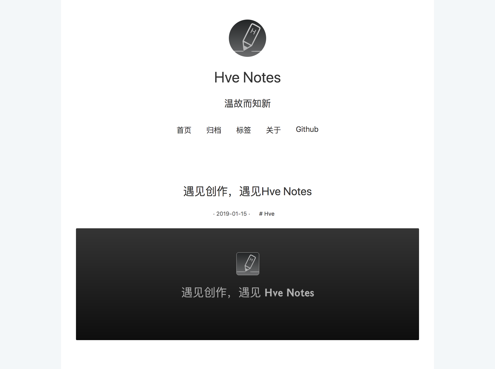
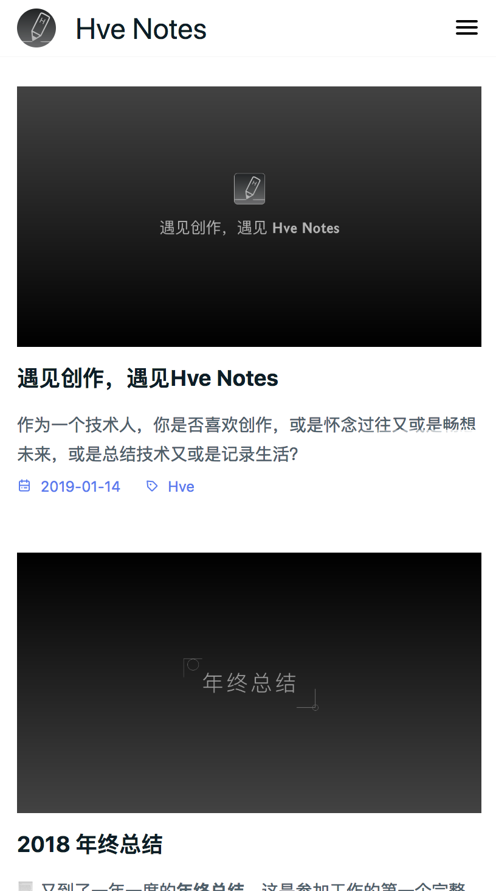

# Hve Notes

<div align="center">
  

  [Download](https://github.com/hellohve/hve-notes/releases) | [Homepage](http://hvenotes.fehey.com/)

  <a href="https://github.com/hve-notes/hve-notes/releases/latest">
    
  </a>

  <a href="https://github.com/hve-notes/hve-notes/blob/master/LICENSE">
    
  </a>

</div>

<div align="center">
  

</div>

English | [简体中文](https://github.com/hve-notes/hve-notes/blob/master/README-zh_CN.md)  

**[CHANGELOG](https://github.com/hve-notes/hve-notes/blob/master/CHANGELOG.md)**  

👏  Welcome to use **Hve Notes** ！  

✍️  **Hve Notes** A static blog writing client. You can use it to record your life, mood, knowledge, notes and ideas...

## Features👇
📝  You can use the coolest  **Markdown** grammar to create quickly  

🌉  You can insert pictures and article cover charts anywhere in the article  

🏷️  You can label and group articles  

📋  You can customize menus and even create external link menus  

💻  You can use this client on **Windows** or **MacOS**  

🌎  You can use **Github Pages** or **Coding Pages** to show the world that more platforms will be supported in the future  

💬  You can simply configure and access the [Gitalk](https://github.com/gitalk/gitalk) or [DisqusJS](https://github.com/SukkaW/DisqusJS) comment system  

🇬🇧  You can use simplified **Chinese** or **English**  

🌁  You can use any default theme within the application or any third-party theme


🌱  Of course **Hve Notes** is still very young and has many shortcomings, but please believe it will keep moving forward 🏃

In the future, it will surely become your inseparable partner

Give full play to your talents！

😘  Enjoy~

## Development
``` shell
$ git clone https://github.com/hve-notes/hve-notes.git
$ cd hve-notes
$ npm install
$ npm run electron:serve
$ npm run electron:build
```

## Contract
[Telegram Group](https://t.me/joinchat/IDY0ahRqb8NPodv95BNpBg)  | QQ Group: 970332209 | Author Twitter: @EryouHao

## Example Screenshots
<div align="center">
  
  
</div>

## Contributions
We welcome all contributions.You can submit any ideas as [pull requests](https://github.com/hve-notes/hve-notes/pulls) or as GitHub [issues](https://github.com/hve-notes/hve-notes/issues).   

## Donation
<div>
  
</div>

## License
[MIT](https://github.com/hve-notes/hve-notes/blob/master/LICENSE). Copyright (c) 2019 EryouHao
