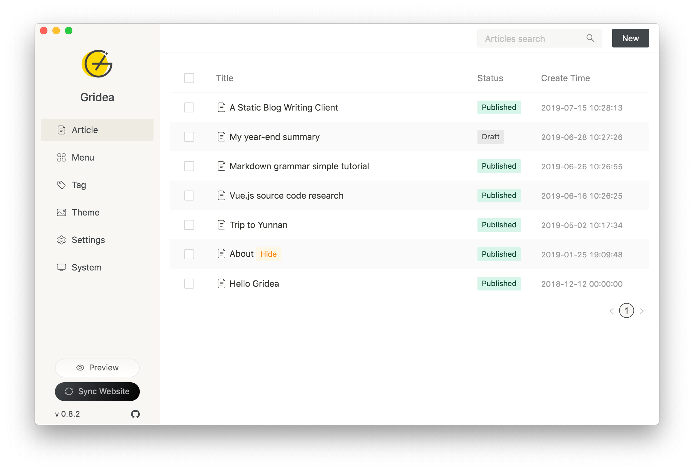
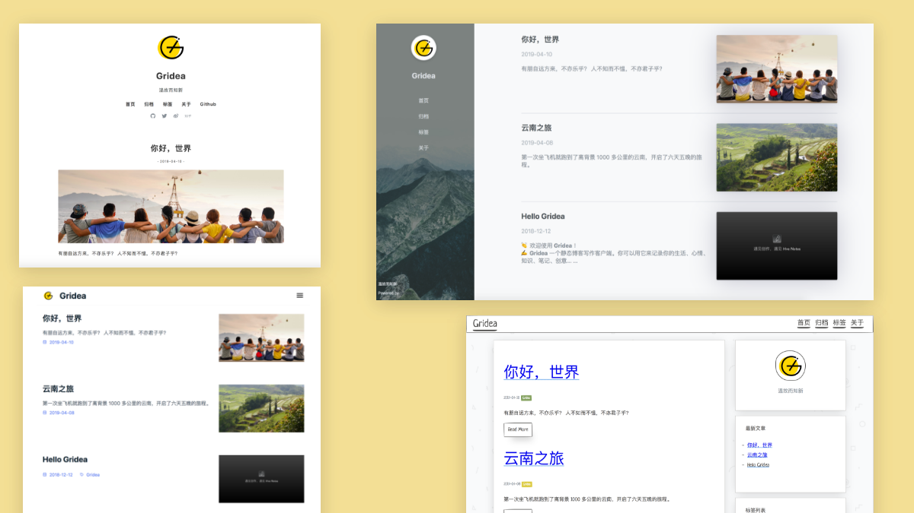

<div align="center">
  <a href="https://gridea.dev">
    
  </a>
  <h1 align="center">
    Gridea
  </h1>
  <h3 align="center">
    A static blog writing client
  </h3>

  [Download](https://github.com/getgridea/gridea/releases) | [Homepage](https://gridea.dev/)

  <a href="https://github.com/getgridea/gridea/releases/latest">
    
  </a>

  <a href="https://github.com/getgridea/gridea/blob/master/LICENSE">
    
  </a>
  
  <a href="https://github.com/getgridea/gridea/releases/latest">
    
  </a>

</div>

<div align="center">
  

</div>

English | [简体中文](https://github.com/getgridea/gridea/blob/master/README-zh_CN.md)  | [繁體中文](https://github.com/getgridea/gridea/blob/master/README-zh_TW.md)

**[CHANGELOG](https://github.com/getgridea/gridea/blob/master/CHANGELOG.md)**  

👏  Welcome to use **Gridea** ！  

✍️  **Gridea** A static blog writing client. You can use it to record your life, mood, knowledge, notes and ideas...

## Features👇
📝  Use the coolest  **Markdown** grammar to create quickly  

🌉  Insert pictures and article cover charts anywhere in the article  

🏷️  Label and group articles  

📋  Customize menus and even create external link menus  

💻  Use this client on **Windows** or **MacOS**  or **Linux**

🌎  Use **Github Pages** or **Coding Pages** to show the world that more platforms will be supported in the future  

💬  Simply configure and access the [Gitalk](https://github.com/gitalk/gitalk) or [DisqusJS](https://github.com/SukkaW/DisqusJS) comment system  

🇬🇧  Use **simplified Chinese**、**traditional Chinese**、 **English**

🌁  Use any default theme within the application or any third-party theme, free theme customization  

🖥  Customize the source folder and synchronize multiple devices using OneDrive, iCloud, Dropbox, etc.  


🌱  Of course **Gridea** is still very young and has many shortcomings, but please believe it will keep moving forward 🏃

In the future, it will surely become your inseparable partner

Give full play to your talents！

😘  Enjoy~

## Development
If you want to contribute code, please check the [Contribution Guide](https://github.com/getgridea/gridea/wiki/%E8%B4%A1%E7%8C%AE%E6%8C%87%E5%8D%97) in advance.

``` shell
$ # Node version > v10.0.0 is requied
$ git clone https://github.com/getgridea/gridea.git
$ cd gridea
$ yarn
$ yarn electron:serve
$ yarn electron:build
```


## Contact
[Telegram Channel](https://t.me/joinchat/AAAAAEj82_lma0Y1wmyqUQ) | [Telegram Group](https://t.me/joinchat/IDY0ahRqb8NPodv95BNpBg)  | QQ 1 Group: 970332209 | QQ 2 Group: 923131213 | Author Twitter: @EryouHao

## Example Screenshots
<div align="center">
  
</div>

## Contributions
We welcome all contributions.You can submit any ideas as [pull requests](https://github.com/getgridea/gridea/pulls) or as GitHub [issues](https://github.com/getgridea/gridea/issues).   

## Donation
<div>
  
</div>

## License
[MIT](https://github.com/getgridea/gridea/blob/master/LICENSE). Copyright (c) 2020 EryouHao
